# Adaptive ROI for Lidar  
## Multi-LiDAR Preprocessing Module  

2023 Summer Internship Program at SKYAUTONET.   

  


## 개요
<center>
25톤 대형트럭의 자율주행화를 위한 라이다 설치방법 및 포인트 클라우드 데이터 압축을 위한 전처리 모듈
</center>
</br>

### 목표
3개의 라이다를 이용해 25톤 대형트럭의 사각지대를 개선할 수 있다.  
3개의 라이다로 인해 급증한 연산량의 절감을 위해 전처리 모듈을 개발하고 적용할 수 있다.  

### 필요성
25톤 대형트럭은 일반적인 라이다센서 설치방법을 사용하기엔 부족한 점이 많다.  

이에 본 프로젝트와 같이 3개의 저가 라이다센서를 배치한 설치방법과 데이터 압축을 위한 전처리 방법론을 제시한다.  

### 확장가능성
대형화물트럭의 군집주행 모드에 적용 시 더 후방 라이다는 끄고 측방만 고려하는 등 더 높은 연산성능을 기대할 수 있다.

## Flowchart
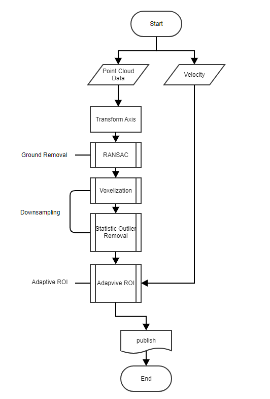 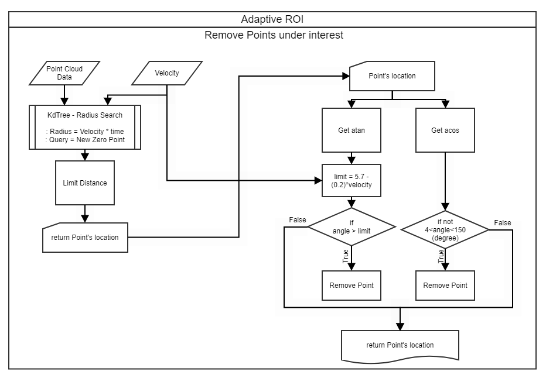
</br>

### Tools
* ROS2(Foxy)
* C++

### Dataset
* Rosbag files - Ouster1 64ch sample dataset

</br>

## 라이다 설치
***1개의 상단부 서치 센서 대비 3개의 중단부 설치 센서를 이용해 감지 영역의 반경을 유지하며 25톤 대형트럭의 차체 근방 사각지대를 개선할 수 있다.***  
</br>

**기존의 일반적인 라이다 설치**
> : 최상단(루프) 1개, FOV $360\degree$  

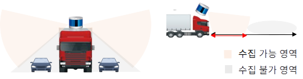

**문제점**  
> 차량의 크기로 인해 사각지대가 매우 커진다.  
> 이 경우 기울여 설치하는 방법을 사용하나 이 또한 먼 곳까지 커버할 수 없다.  

</br>

**개선한 라이다 설치**
> 차체 중단부 3개(측방 2개, 후방 1개), FOV 측방 $270\degree$, 후방 $150\degree$  

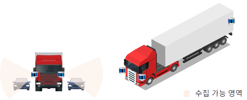

**기대효과**
> 차체 근방 사각지대 개선이 가능하다.  
> 탐지 반경(영역)의 손실 없이 데이터 보존이 가능하다.


</br>

## 전처리 기법
***3개의 비처리 센서 대비 중복영역 제거 알고리즘으로 불필요한 데이터를 제거해 25톤 대형트럭의 사각지대를 줄일 수 있으며,</br> 속도를 기반으로 수평 관심영역의 반경, 정지거리를 기반으로 수직 관심영역의 각도를 조절 및 연계해 효율적인 처리가 가능하다.***  

본 프로젝트는 전처리 모듈에 그 개발 목표와 중점을 두고 있다.  
아래와 같은 3단계의 과정을 거쳐 전처리가 진행된다.  
개발의 가장 중요한 목표는 불필요한 데이터 영역을 제거하고, 데이터 압축률을 높이는 것이다.

> 1. Ground Removal  
> 2. Downsampling  
> 3. Adaptive ROI

</br>

### Ground Removal
본 프로젝트에서는 차선 정보가 필요하지 않다. 또한 바닥은 타 데이터에 비해 등고선 형태를 띄고 있어 이후 처리에서 좋지 않은 영향을 미칠 수 있다.  

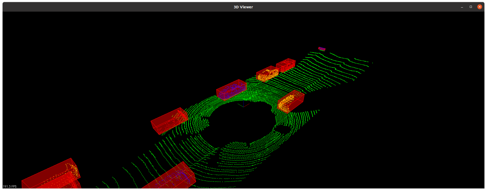

이에 `RANSAC` 알고리즘을 사용해 바닥을 제거하고, 객체만 추출하는 프로그램을 작성했다.  
> 이 외에도 `Pass Through` 필터를 이용해 `z`축을 일정 부분 제거하는 알고리즘도 존재하나, 사용한 데이터셋의 밑면이 평행하지 않았기 때문에 작동하지 않았다.

</br>  

### Downsampling
#### Voxel(Volume + Pixel) 
2D 이미지를 구성하는 최소 단위인 pixel(picture element)을 3D로 확장한 것  
즉, 이미지 1x1에서 깊이 정보를 포함한 1x1x1로 표현된 최소 단위  
단위는 고정되어 있지 않고 사용자가 정의 가능

> 일부 문서에서는 3D Box, Cube라고도 표현

**Voxelization**

복셀화, point cloud를 Voxel로 변환하는 작업  
PCL에서는 `Voxel Grid filter`를 이용하여 복셀화를 진행

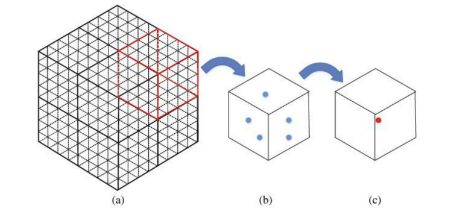


알고리즘

1. 사용자 정의로 적합한 Voxel크기(=leaf_size)를 선택

2. 각 voxel의 중심점에서 leaf size내 포인트 유무를 계산

3. 포인트들의 중심점을 계산 하고 나머지 포인트는 제거


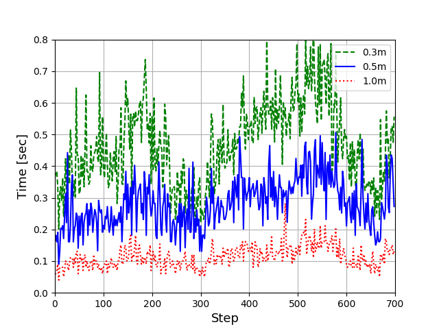

voxel 단위(=`leaf_size`)가크면 데이터의 양을 더 줄일수 있다. 하지만, 물체 표현력은 줄어듦  
결국 복셀화는 계산 부하와 물체 표현력의 트레이드 오프 관계에서 최적의 단위(=`leaf_size`)를 구하는 것이 가장 중요

</br>

#### SOR - Statistical Outlier Removal

Statistical Outlier Removal는 outlier를 제거하는 알고리즘

  

n=1, 2, …, N 개의 point가 있을 때 n 번째 point를 기준으로 인접한 k개의 point들과 평균과 분산을 구해서 분산이 세팅한 parameter보다 큰 값이면 outlier로 간주하고 제거

장점 : 위 그림같이 부정확하게 측정된 point를 제거할 수 있음

→ 채널이 많은(>32) 3D LiDAR로 얻은 PointCloud에서는 SOR을 잘 쓰지 않음

: 인접한 k개의 point를 찾는 것도 연산이 너무 오래 걸리기 때문 
필연적으로 voxelization 사용하는데, 이는 Leaf 내부의 여러 point의 평균을 내기 때문에 side effect로 outlier의 영향을 줄일 수 있음 따라서 굳이 사용하지 않아 된다는 필자의 개인적 견해

→ 3D 보다는 2D LiDAR에서 좀 더 효과적

: Clustering 전에 SOR로 심한 outlier 제거한 후 clustering을 하면 좀 더 robust 하게 clustering 가능

</br>

### Adaptive ROI
차량의 속도에 맞게 변화하는 관심영역이다.  
Horizontal, Vertical 두 가지 설계를 가지며 이 둘은 속도에 기반해 연계되어 작동한다.  
차량의 속도가 증가할수록 Horizon은 넓어지고, Vertical은 좁아지며 전체 Point Data의 개수와 압축률을 유지한다.

*Ouster의 라이다의 경우 좌표축이 진행방향과 다르기 때문에 $270\degree$의 회전변환행렬을 적용해 축을 정리해 주는 과정이 필요하다.*

#### Horizontal ROI
수평적 관심영역은 아래와 같은 4단계로 진행된다.  

1. 도로주행영역 추출
2. 중심점 이동
3. 각도 제한
4. 속도에 따른 반경 제한

먼저 Ouster 라이더의 Horizon FOV를 알아보면, `Azimuth_Window` 지표로 조절이 가능하다.  
이에 측방 2개의 라이더는 $270\degree$로, 후방 1개의 라이더는 $120\degree$로 지정 및 조절한다.

**1. 도로주행영역추출**  
도로 이외의 외부 데이터는 불필요하다.  
한국 기준 가장 많은 차선의 고속도로는 왕복 12차선으로, 6차선의 길이인 약 `21m`를 기준으로 좌우 관심영역을 제한한다.
> 갓길, 우회차도 등의 다양한 차도환경을 고려해 차선영역추출 기법을 고려했으나, 빠른 처리를 우선으로 하는 본 프로젝트의 목적에 걸맞게 간단한 처리로 진행했다.

`Pass Through`필터를 사용해 x축 영역을 제한했다.
아래의 이미지는 측방 중 좌측의 라이다를 기준으로 도로주행영역을 제한한 결과이다.

가로 `2.5m`, 세로 `10.1m`를 가지는 25톤 대형트럭에 맞게 제한영역을 아래와 같이 설정했다.

```C++
pcl::PassThrough<pcl::PointXYZI> pass;

pass.setInputCloud(input_cloud);
pass.setFilterFieldName("x");
pass.setFilterLimits(-13.0, +2.5);
pass.filter(output_cloud);
```
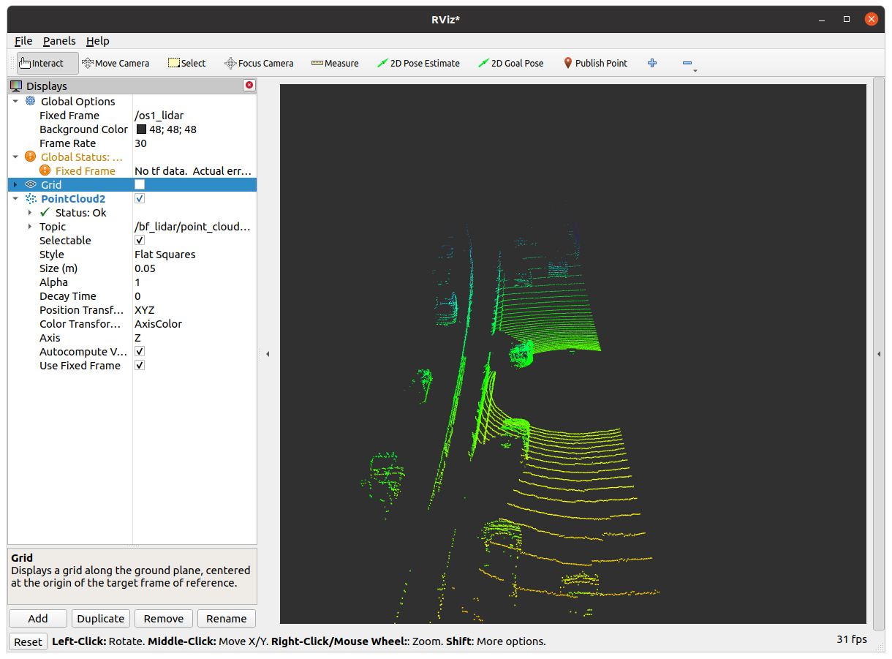

> 실험결과 데이터셋 기준 24%의 압축률을 보임

**2. 중심점 이동**  
중심점을 이동하는 이유는 다음과 같다.
- 이동하지 않는 경우:
    - 중복되는 구간이 많아 낭비되는 데이터가 상당하다.  
    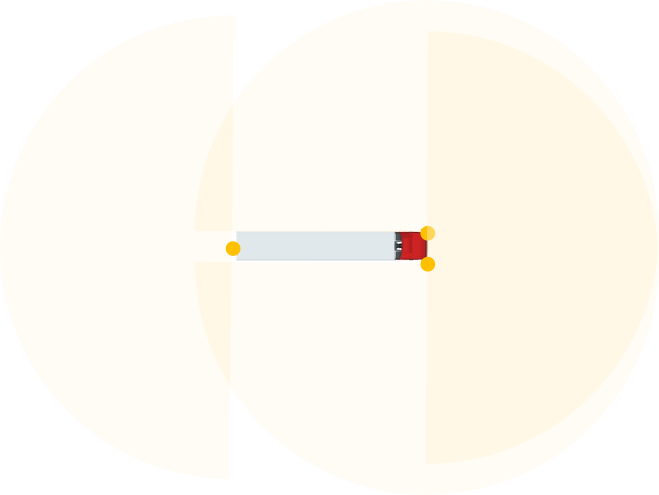

    - 각도를 조절한다면 아래와 같이 사각지대가 발생한다.  
    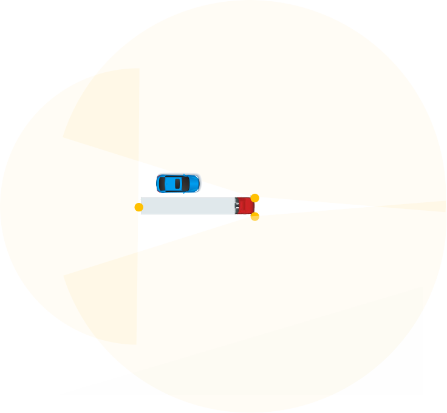

위 이미지처럼 각도를 기준으로 조절하기에는 사각지대 발생 혹은 중복지역 발생 등 여러 문제가 발생했고, 이에 아래와 같이 중심점을 이동해 설계했다.  

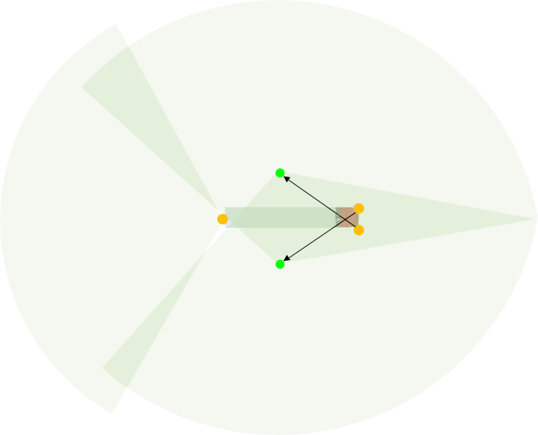  

좌측 측방 라이다를 기준으로 그 각도 및 중심점 설정 기준은 아래와 같다.  

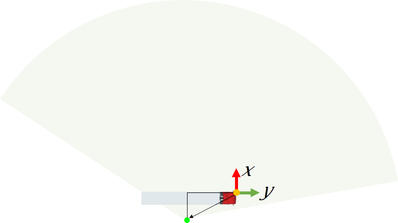  

차량의 길이를 기준으로 `/2`한 값을 y축 좌표로, `/4`한 값을 x축 좌표로 지정했다.
이는 각도를 계산한 값으로, 이에 관해서는 이후 각도이동에서 설명하도록 하겠다.

*2. 중심점 이동*과 *4. 반경 제한*은 `KdTree`라이브러리의 `Radius_Search`기법을 사용했다.


**3. 각도 제한**  
차량 주변의 사각지대를 최소한으로 줄이는 동시에 센서 간의 중복영역을 최소화하기 위해 아래와 같은 설계로 각도를 제한한다.  
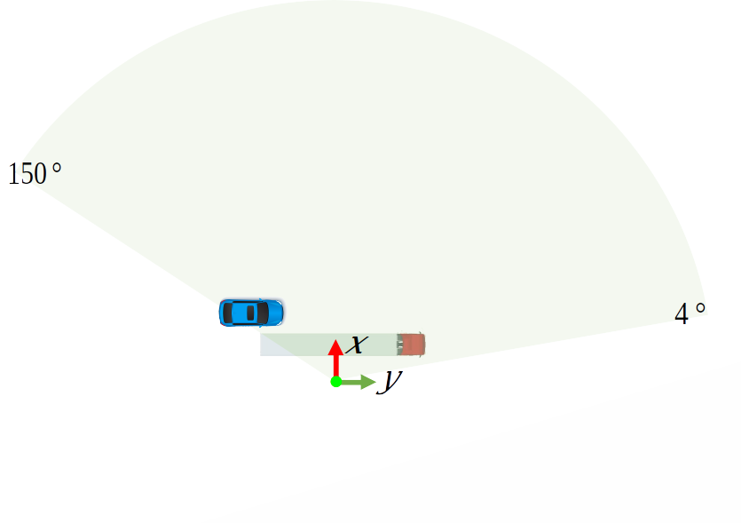
- 전면은 전방 주시가 가능하고 빈 부분이 없는 각도일 것($4\degree$)
- 후면은 차체를 가릴 수 있는 각도일 것($150\degree$)  

현재는 이동한 중심점을 기준으로 설정한 각도(후면)이며, 전면 각도의 경우 $1\degree$의 각도로도 큰 차이를 초래할 수 있어 최대 $4\degree$의 값으로 지정했다.

중심점을 이동하며 최대한의 각도를 포함하고, 영역의 범위에 큰 차이가 없도록 하기 위해서는 차체의 길이의 절반인 `y`좌표로 이동해야 한다. 이에 맞게 `2:1`의 비율을 유지하도록 `x`좌표 또한 `y`의 절반으로 지정해 이동하도록 고려했다.

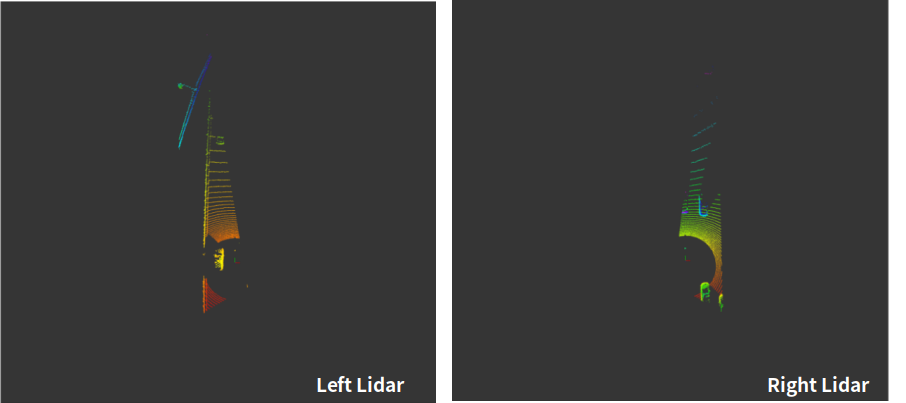  

**4. 반경 제한**  
차량의 속도를 기준으로 아래와 같은 조건을 만족하는 알고리즘을 설계했다. 주행 모드는 크게 2가지이며, 각각의 주행모드에서는 속도에 따라 선형적으로 반경이 증가한다.  

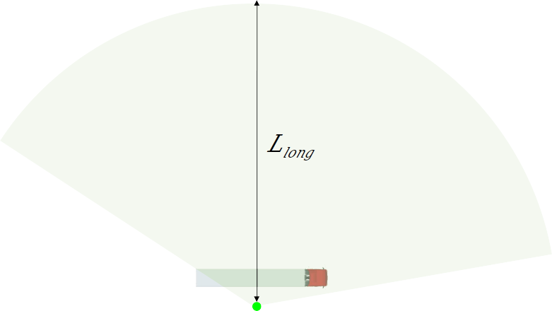

반경의 수식은 아래와 같다.  
> $L_{long} = v_x * (t_{delay} + t_{detect} + t_{safe})$

|지표|의미|가정값|
|--|--|--|
|$v_x$|차량의 속도(km/h)||
|$t_{delay}$|액추에이터 지연 시간|`0.5sec`|
|$t_{detect}$|Point Cloud 인지 시간|`0.3sec`|
|$t_{safe}$|안전속도를 위한 시간|`1.0sec`|
||*Total*|`1.8sec`|

위 지표와 수식을 통해 도출한 속도별 모드의 반경은 아래와 같다.
|모드|속도|반경|
|--- |--- | ---|
|저속모드|60km/h|108m|
|고속모드|80km/h|144m|

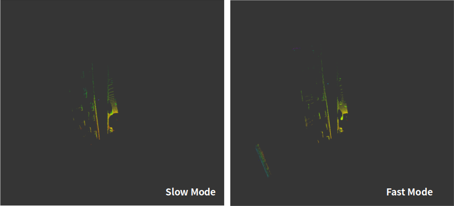
</br>

#### Vertical ROI
수직적 관심영역은 속도에 따라 3가지 모드로 분류된다.

먼저 Ouster 라이더의 Vertical FOV를 알아보면, $-22.5\degree$~ $22.5\degree (45\degree)$ 임을 알 수 있고, 이는 별도로 조정 가능하지 않다.

또한 상/하단 각도로 분류했을 때, 비교적 유의미한 데이터가 적은 상단 각도와 달리 하단 각도는 근처의 차량을 감지해야 하므로 각도를 줄이는 것은 위험할 수 있다.  
*이에 하단의 각도는 $-22.5\degree$로 유지하고, 상단의 각도만 조절한다.*
</br>
한국 기준 고속도로를 주행할 수 있는 차량의 높이<sub>적재물 포함</sub>는 최대 `4.2m`이며, 여유값을 포함한 `4.5m`를 높이로 지정 후 아래의 과정을 통해 각도를 도출했다.

모드별 각도를 설정하기 위한 반경의 기준은 25톤 대형트럭(공차)의 정지거리로 계산했으며, 차량 속도별 정지거리는 아래와 같다.

|속도|정지거리|가정값|
|--|--|--|
|60km/h|29.4m ~ 34.3m|30m|
|70km/h|37.7m ~ 43.5m|
|80km/h|47.1m ~ 53.7m|50m|

따라서 Horizon에서 지정했던 저속/고속 모드와 기본모드를 이용해 분류하면 아래와 같다.
|모드|속도|각도|
|--|--|--|
|일반모드| ~ 60km/h| $22.5\degree$|
|저속모드|60km/h|$9.5\degree$|
|고속모드|80km/h|$5.7\degree$|

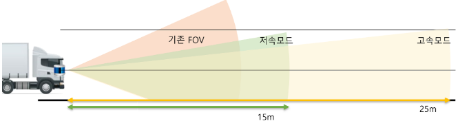

저속모드에서 고속모드까지는 속도에 따라 선형적으로 각도가 변화하며 그 수식은 아래와 같이 도출했다.

> $ angle = -0.2 \times (v_x - 80) + 5.7$

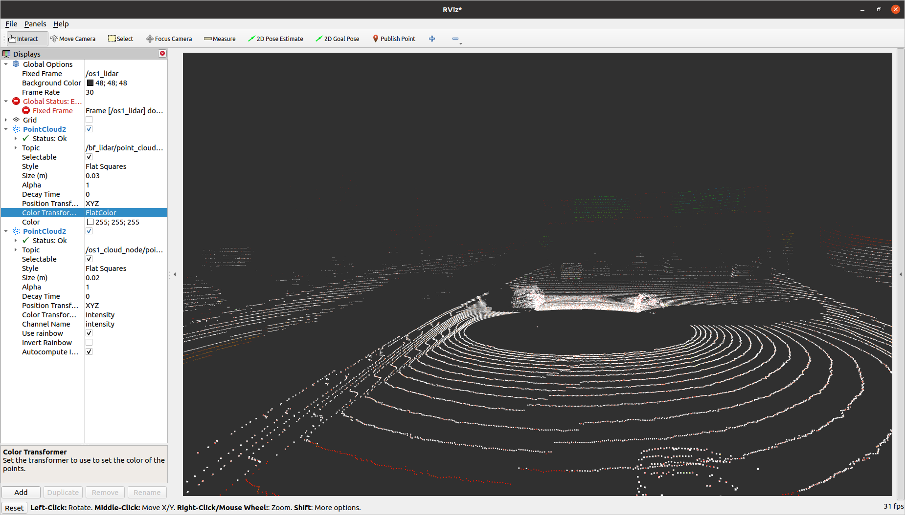


#### Adaptive ROI - Prototype
Horizon과 Vertical을 통합해 속도에 맞게 증가하는 모습을 나타내는 결과는 아래와 같다.


|속도|	모드	|Horizontal 반경	|Vertical 각도	|Filtered Point(Average)	|Rate|
|--|--|--|--|--|--|
|30km/h|	일반주행	|54	|   22.5|	1526|	99%|
|60km/h|	저속주행	|108|	9.8|	2339|	98%|
|80km/h	|   고속주행	|144|	5.7|	1978|	98%|

